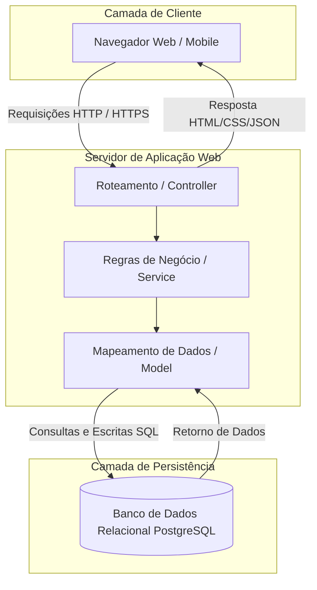

## 8. METODOLOGIA

O desenvolvimento do sistema **TechFood-Solutions** adota a metodologia ágil **Scrum** combinada com práticas de **Kanban** para garantir entregas incrementais e contínuas. O processo foi estruturado nas seguintes etapas:

1. **Planejamento e Elicitação**: Reuniões iniciais para definição do escopo, mapeamento de regras de negócio e identificação dos requisitos funcionais e não funcionais.
2. **Projeto Técnico e Arquitetura**: Modelagem do banco de dados relacional e definição da arquitetura do software (padrão MVC - Model-View-Controller) para garantir a separação entre interface, lógica de negócios e persistência de dados.
3. **Desenvolvimento Incremental (Sprints)**: Divisão do projeto em ciclos de desenvolvimento, priorizando inicialmente o módulo de cadastro e pedidos, seguido pelo controle de estoque e, por fim, o painel logístico de entregas.
4. **Testes e Homologação**: Execução de planos de testes unitários e de integração para validar se cada funcionalidade atende estritamente aos critérios de aceitação estabelecidos.

Para a gestão e comunicação da equipe, utilizou-se o quadro do GitHub Projects para controle de tarefas (A fazer, Em andamento, Concluído) e o Git/GitHub para versionamento do código-fonte.

---

## 9. DIAGRAMA TÉCNICO (Arquitetura do Sistema)

O diagrama abaixo representa a arquitetura técnica da solução, demonstrando o fluxo de requisições do cliente e do administrador do restaurante através da camada Web até o banco de dados.

---

## 10. LISTA DE COMPONENTES TÉCNICOS

Para a sustentação e funcionamento do sistema **TechFood-Solutions**, mapeou-se a seguinte pilha de componentes tecnológicos:

* **Front-end (Interface do Usuário)**: HTML5, CSS3 e JavaScript (ES6) com design responsivo baseado em Flexbox/Grid para garantir compatibilidade com dispositivos móveis.
* **Back-end (Servidor de Aplicação)**: Ambiente de execução Node.js com o framework Express, responsável por processar as regras de negócio, rotas e autenticação.
* **Banco de Dados (Persistência)**: Sistema Gerenciador de Banco de Dados (SGBD) relacional PostgreSQL para o armazenamento seguro de dados de usuários, insumos e histórico de pedidos.
* **Ambiente de Hospedagem / Nuvem**: Utilização de uma Máquina Virtual (VM) Linux na nuvem (AWS EC2 ou Render) para hospedagem contínua da aplicação web e do banco de dados.

---

## 11. PLANO DE TESTES

Abaixo estão descritos os 6 cenários de testes fundamentais para garantir o comportamento correto do TechFood-Solutions antes de sua homologação.

| ID | Cenário de Teste | Procedimento / O que testar | Resultado Esperado |
| :--- | :--- | :--- | :--- |
| **CT-01** | Cadastro de usuário com e-mail já existente | Tentar cadastrar uma nova conta utilizando um e-mail idêntico a um já armazenado no banco de dados. | O sistema deve bloquear o cadastro e exibir a mensagem: "E-mail já cadastrado". |
| **CT-02** | Validação de senha curta no cadastro | Tentar criar um usuário digitando uma senha com menos de 6 caracteres. | O sistema deve impedir o envio e exibir um alerta de validação de campo. |
| **CT-03** | Finalização de pedido com carrinho vazio | Tentar clicar no botão "Finalizar Pedido" sem ter adicionado nenhum item do cardápio ao carrinho. | O botão deve estar desabilitado ou o sistema deve emitir o aviso: "Seu carrinho está vazio". |
| **CT-04** | Baixa automática de insumos no estoque | Realizar um pedido de um prato (ex: Hambúrguer) que consome 1 unidade de carne do estoque. | O banco de dados deve reduzir exatamente em 1 unidade a quantidade disponível de carne. |
| **CT-05** | Alerta visual de estoque mínimo atingido | Diminuir a quantidade de um insumo até que ela fique abaixo do limite crítico configurado. | O painel do administrador deve destacar o item com uma cor de aviso (ex: vermelho/laranja). |
| **CT-06** | Mudança e persistência do status de entrega | O administrador altera o status de um pedido de "Em Preparo" para "Saiu para Entrega". | O novo status deve ser gravado no banco de dados e refletido imediatamente na tela de acompanhamento do cliente. |
